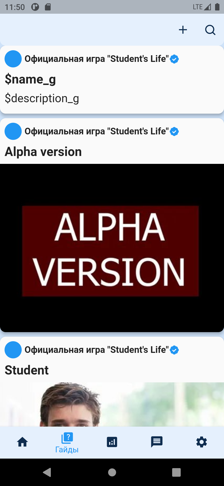
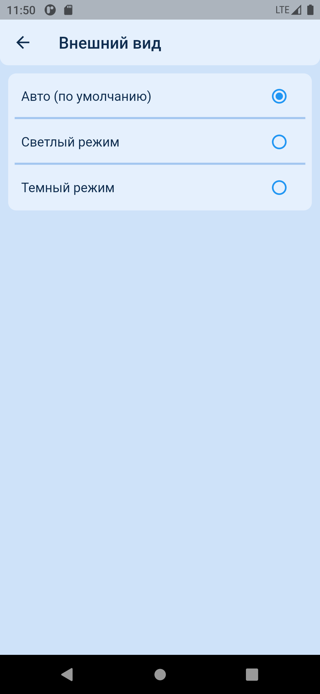
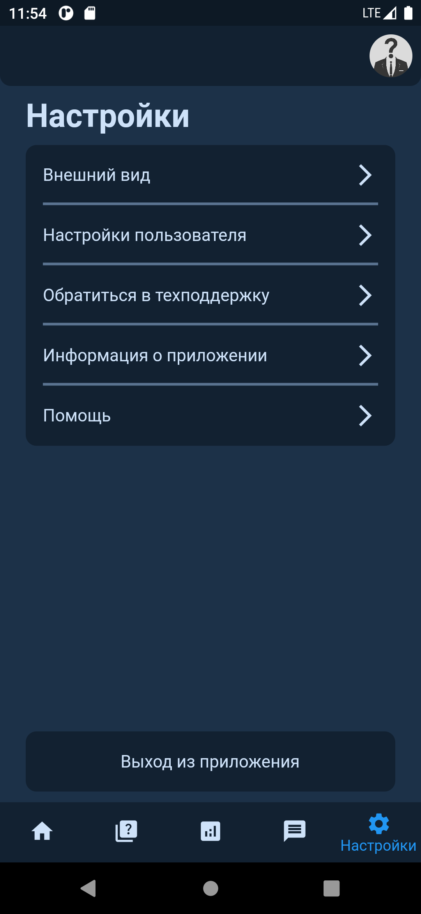
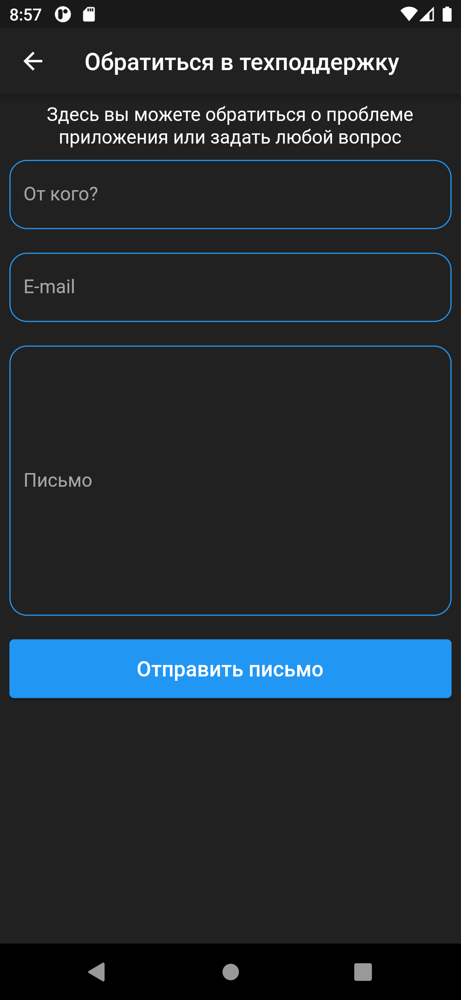
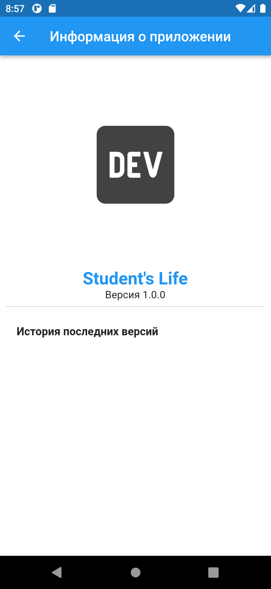
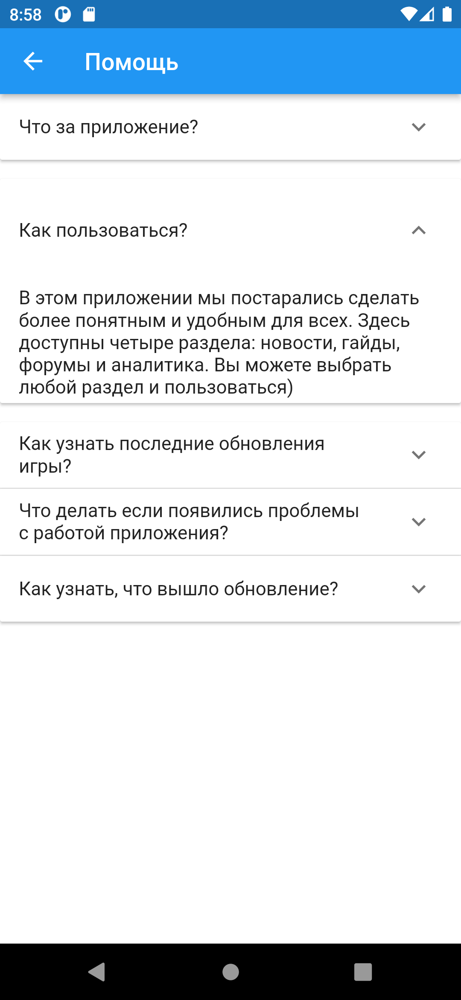

# Student's Life

Student Simulator, 2D, mobile app
Мобильное приложение — 2FA, мессенджера, платформа для доступа к игре

Вся информация о создании [тут](https://github.com/ISUCT/2-147-January-May-2023/issues/10) и [тут](https://github.com/ISUCT/2-147-January-May-2023/issues/17#issue-1593513723)

Дублирование задач
### Mobile:

- Собирать статистику/аналитику
- Частичный функционал (например часть мини-игр)
- Гайды по игре
- Форумы/чаты
  - Направленность, например, по кланам
  
<!-- ### APIs (откуда взято)
http://80.90.188.52:8080/docs/ -->

### Схема

### Скрины приложения

  
  Админка

