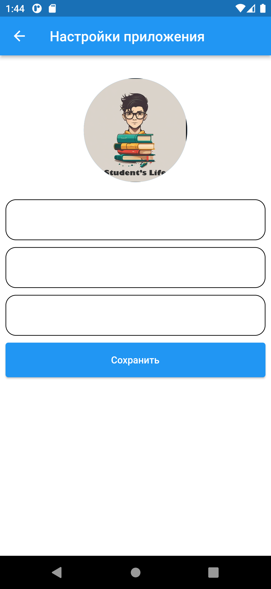
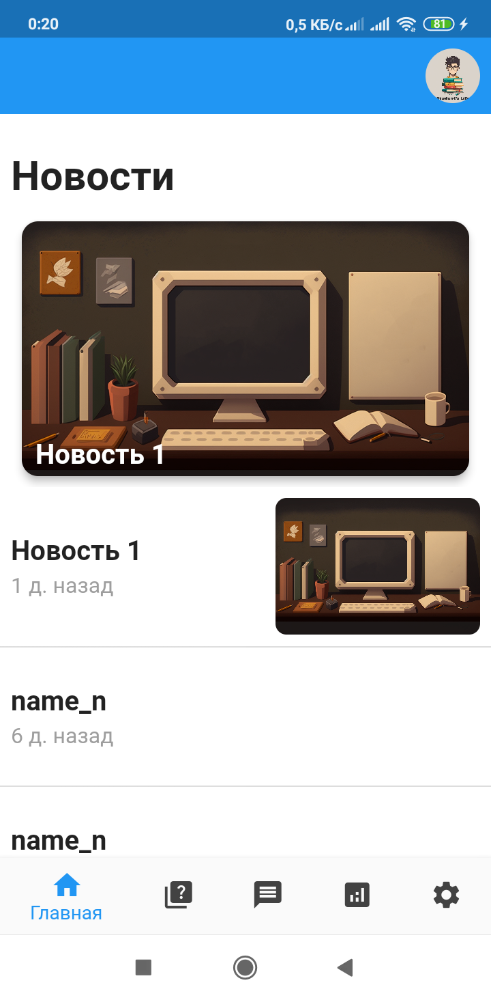
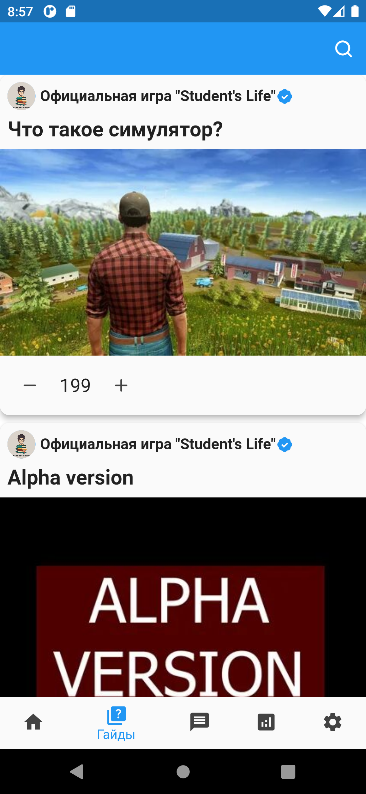
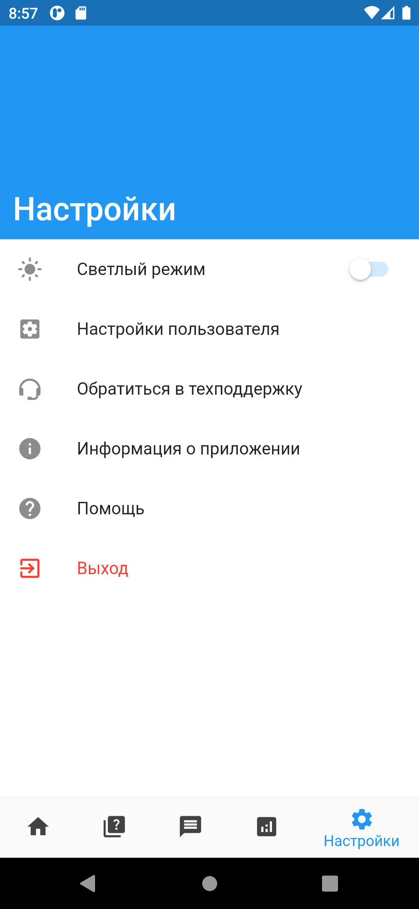
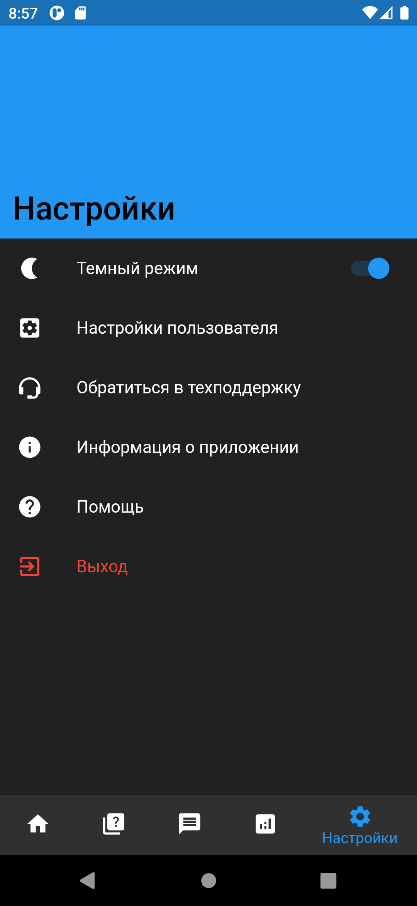

# Student simulator

Student Simulator, 2D, mobile app
Мобильное приложение — 2FA, мессенджера, платформа для доступа к игре

Вся информация о создании [тут](https://github.com/ISUCT/2-147-January-May-2023/issues/10) и [тут](https://github.com/ISUCT/2-147-January-May-2023/issues/17#issue-1593513723)

Дублирование задач
### Mobile:

- Собирать статистику/аналитику
- Частичный функционал (например часть мини-игр)
- Гайды по игре
- Форумы/чаты
  - Направленность, например, по кланам
  
### Дизайн приложения: 
- [Настройки](https://github.com/ISUCT/2-147-January-May-2023/issues/25#issuecomment-1448242704)

### Схема

### Скрины приложения

  
  Админка

